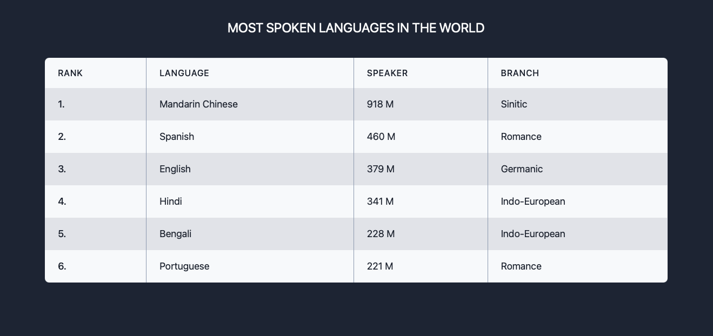
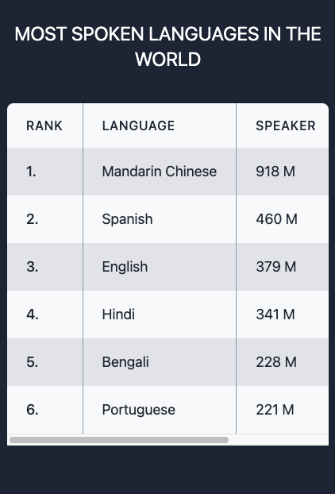

# TailwindCSS-Component: Table

This repository features a sophisticated and responsive table component designed with TailwindCSS.

## Features

- Responsive design that ensures compatibility with both desktop and mobile devices.
- Clean and modern look to display language statistics effectively.
- Easy to integrate and customize with TailwindCSS Play CDN.

## Preview

Desktop view:



Mobile view:



## Usage

To integrate this table component into your project, you can directly copy the HTML and CSS from the `language-table.html` file in this repository. Ensure that your project includes this TailwindCSS CDN link if it is not already part of your setup:

```html
<!-- TailwindCSS CDN for easy and quick integration -->
<link href="https://cdn.tailwindcss.com" rel="stylesheet">
```

## Access

Visit the live demo of the language statistics table component here: https://eliottdelhaye.github.io/TailwindCSS-Component-Table/
